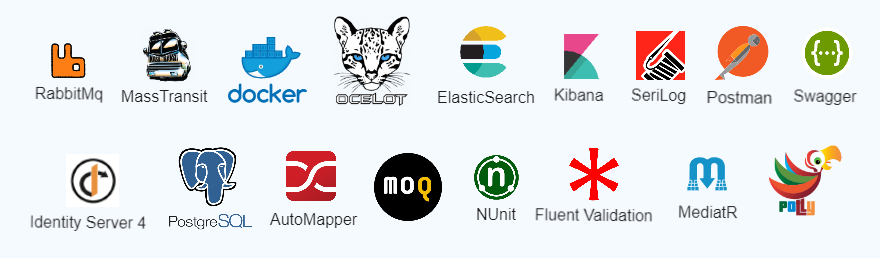
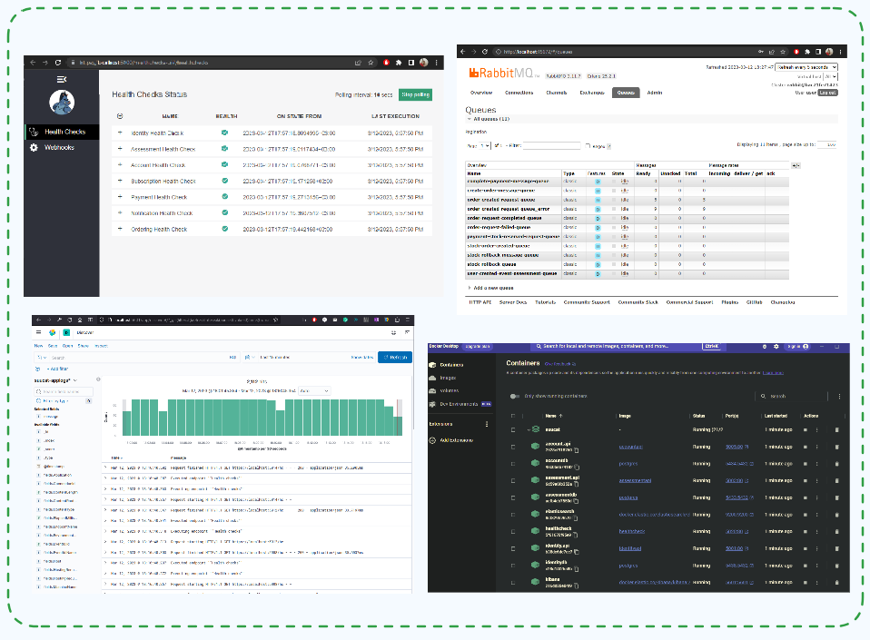

# Ecxom : .NET  microservices application #

Ecxom is a containerized application consisting of several microservices.

Development is still in progress. 

## Ecxom Microservices Architecture Overview

 

## Tech Stack
  
  

## References

[Ocelot](https://ocelot.readthedocs.io/en/latest/introduction/gettingstarted.html)  
[Identity Server](https://identityserver4.readthedocs.io/en/latest/quickstarts/0_overview.html)  
[Masstransit Saga](https://masstransit.io/documentation/patterns/saga)  
[Clean Architecture](https://github.com/jasontaylordev/CleanArchitecture)  
[Health Monitoring](https://learn.microsoft.com/en-us/dotnet/architecture/microservices/implement-resilient-applications/monitor-app-health)
[RabbitMQ](https://www.rabbitmq.com/documentation.html)  

